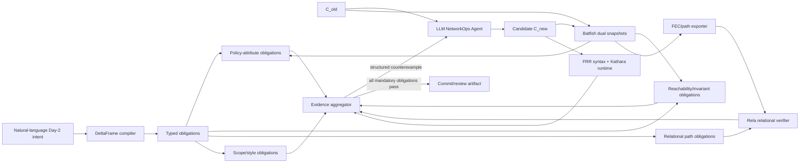

# Batfish + Rela Integration for PathDelta-Agent

## Decision

Use both, but give them different proof obligations:

- **Batfish** parses `C_old` and `C_new`, computes control-plane/data-plane
  snapshots, performs symbolic route-policy comparison, differential
  reachability, session/config checks, and exports normalized forwarding paths.
- **Rela** checks whether the supplied pre/post path languages obey the
  intent-relative relation: replace/add/remove/drop/preserve.
- **FRR/Kathara** remains the runtime/convergence backend for sampled high-risk
  cases.

Rela must not be described as parsing FRR or proving that Batfish extracted a
complete snapshot. It proves a relation over the paths/graphs it is given.

## Revised pipeline



## Obligation dispatch

| Change-envelope obligation | Primary backend | Why |
| --- | --- | --- |
| Prefix/community/AS-path/local-pref policy transformation | Batfish `compareRoutePolicies`, `testRoutePolicies`, `searchRoutePolicies` | Symbolic route-policy analysis including route attributes |
| Reachability gained/lost; isolation; waypoint constraints | Batfish differential reachability and traceroute | Searches packet header space and computes traces |
| Target path should replace/add/remove a segment | Rela over Batfish-exported FEC path sets | Exact relational statement across snapshots |
| Non-target path language must remain identical | Rela `preState = postState` | Compact frame condition without enumerating expected future paths |
| BGP sessions, parse/reference integrity, RIB state | Batfish snapshot questions | Configuration/control-plane evidence outside Rela's model |
| Text scope, shared-object graph, convention, budget | PathDelta Change Envelope | Operational and repository-local properties |
| Runtime convergence and implementation fidelity | FRR/Kathara | Independent dynamic evidence |

Rela is mandatory only when the intent has a path-language consequence and the
path exporter can supply complete evidence at the declared abstraction. For a
pure timer or local configuration convention change, Rela should be marked
`not_applicable`, not forced into a meaningless pass.

## Interface schemas

The DeltaFrame compiler should emit typed semantic obligations rather than one
generic boolean:

```json
{
  "target_obligations": [
    {
      "kind": "route_policy_attribute_delta",
      "node": "edge",
      "policy": "RM_A_IN",
      "input_prefix_space": ["203.0.113.0/24"],
      "field": "localPreference",
      "before": 100,
      "after": 250,
      "backend": "batfish_compare_route_policies"
    },
    {
      "kind": "path_relation",
      "fec_selector": {"prefix": "203.0.113.0/24", "source": "edge"},
      "relation": {"kind": "replace_symbol", "from": "peer-b", "to": "peer-a"},
      "backend": "rela"
    }
  ],
  "frame_obligations": [
    {
      "kind": "path_preserve",
      "fec_selector": {"prefix": "192.0.2.0/24", "source": "edge"},
      "relation": {"kind": "preserve"},
      "backend": "rela"
    }
  ]
}
```

Batfish path observations are normalized into the existing Rela adapter schema:

```json
{
  "snapshot_id": "scenario_path_replace",
  "path_source": "batfish_traceroute_from_fresh_pre_post_snapshots",
  "fecs": [
    {
      "fec_id": "target",
      "class": "target",
      "before_paths": [["edge", "peer-b"]],
      "after_paths": [["edge", "peer-a"]],
      "allowed_change": {"kind": "replace_symbol", "from": "peer-b", "to": "peer-a"}
    },
    {
      "fec_id": "control",
      "class": "non_target",
      "before_paths": [["edge", "peer-b"]],
      "after_paths": [["edge", "peer-b"]]
    }
  ]
}
```

Every path bundle must record:

- Batfish network/snapshot IDs and image/version;
- source/destination/header/FEC selector;
- path abstraction: interface, device, or device-group;
- whether all ECMP traces were exported or a bound was hit;
- parse and unsupported-feature warnings;
- baseline/candidate configuration hashes;
- extraction duration and query parameters.

If completeness is unknown or `maxTraces` is saturated, the obligation cannot
silently pass. It becomes `bounded`, `review_required`, or `not_available`.

## Counterexample feedback

The Agent should not receive only “Rela failed”. Translate failures into a
network-specific record:

```json
{
  "obligation": "non_target_path_preserve",
  "fec": "192.0.2.0/24 from edge",
  "expected_relation": "preserve",
  "before_paths": [["edge", "peer-b"]],
  "after_paths": [["edge", "peer-a"]],
  "likely_dependency": "RM_A_IN is broader than PL_TARGET",
  "admissible_direction": "restrict the new high local preference to the target prefix"
}
```

The last field is a repair direction, not a reference patch.

## Completed integration smoke

The smoke uses three freshly generated FRR nodes and does not read any old
dataset or result. Batfish computes the paths; the pinned unmodified Rela image
verifies the relation.

Positive candidate:

```text
target 203.0.113.0/24: edge -> peer-b  becomes  edge -> peer-a
control 192.0.2.0/24: edge -> peer-b  remains  edge -> peer-b
```

Observed results:

- Batfish parsed all three nodes in both snapshots. The only parse warnings
  are the two FRR header lines that the Cisco-compatible parser ignores.
- Batfish symbolic route-policy comparison returned exactly one difference:
  target prefix local preference `100 -> 250`.
- Batfish differential reachability returned zero rows because reachability
  remained successful before and after.
- Rela accepted the target replacement plus non-target preservation relation.
- A collateral candidate changed both target and control to `peer-a`.
  Differential reachability still returned zero rows, while Rela rejected the
  non-target preservation obligation.

This establishes complementarity, not general accuracy or scalability.

Artifacts:

- `tools/build_msn2026_v8_batfish_rela_dev.py`
- `experiments/msn2026_v8_day2_agent/run_batfish_rela_smoke.py`
- `data/msn2026_v8_batfish_rela_dev/dataset_manifest.json`
- `results/msn2026_v8_batfish_rela_dev/batfish_rela_summary.json`
- `results/msn2026_v8_batfish_rela_dev/rela_input.json`
- `results/msn2026_v8_batfish_rela_dev/rela_result.json`
- `results/msn2026_v8_batfish_rela_dev/rela_result_collateral_negative.json`

## Changes needed for a paper-quality integration

1. Replace concrete one-destination traceroutes with a FEC partitioner and an
   exporter that captures all relevant paths or forwarding graphs.
2. Add Batfish baseline/candidate support to
   `verification_layer/batfish_validator.py`; the current implementation is
   candidate-only and target-centric.
3. Generalize the Rela compiler beyond `replace_symbol` and exact path pairs to
   frontend operations `Preserve`, `Add`, `Remove`, `Replace`, `Drop`, and
   scoped `Any`.
4. Treat Batfish unsupported route-policy features and parse warnings as
   explicit assurance evidence.
5. Run FRR/Kathara on selected accepted and rejected cases to measure model
   mismatch.
6. Return Rela/Batfish counterexamples to the Agent and measure whether they
   improve revision success versus raw diagnostics.
7. Evaluate interface/device/device-group path abstractions separately because
   they can change both soundness and cost.

