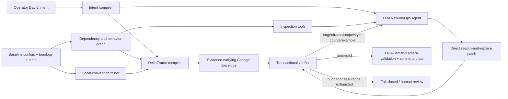

# PathDelta-Agent: Intent-Relative Change Contracts for Brownfield Day-2 Reconfiguration

## 1. Decision

The recommended paper is **not** “LLM beats rules at configuration
correctness” and is **not** another “agent plus Batfish verifier” paper.

The proposed paper studies a different problem:

> A running network is currently valid. An operator requests a partial Day-2
> behavior change in natural language. The request says what should change, but
> does not enumerate everything that must remain unchanged. How can an LLM
> agent directly edit heterogeneous legacy configurations without turning that
> underspecified change into collateral network behavior?

The key abstraction is an **intent-relative Change Envelope**, whose semantic
core is called **DeltaFrame**. PathDelta automatically converts the baseline
network and the partial intent into:

1. the semantic behaviors allowed or required to change;
2. frame conditions for all relevant behavior outside that scope;
3. protected shared dependencies and non-target bindings;
4. locally inferred naming, sequence, indentation, and parameter conventions;
5. an operational footprint budget and an explicit assurance level.

The LLM agent retains control over exploration, tool choice, and the concrete
configuration edit. PathDelta owns only admission to the network.

## 2. Why the problem is different from configuration repair

Configuration repair normally assumes a fixed, complete specification.
Using the notation in the CORNETTO/Asadli setting:

```text
Given:  broken configuration C_broken and fixed specification set Phi
Find:   C_fix such that C_fix satisfies Phi
```

A Day-2 change has a different shape:

```text
Given:  valid baseline C0 satisfying Phi0, plus partial change intent I
Infer:  desired additions Phi_plus, obsolete/relaxed predicates Phi_minus,
        and preservation frame Phi_frame = Phi0 minus Phi_minus
Find:   C1 such that C1 satisfies Phi_plus and Phi_frame,
        while respecting structural and convention constraints
```

The difficult part is not merely finding configuration text. It is inferring
the **specification delta**: which old behavior is intentionally superseded and
which old behavior is still a contract. A goal-only verifier checks
`Phi_plus` but misses collateral changes. A repair verifier with unchanged
`Phi0` may reject the requested change itself. A simple textual minimum can be
actively dangerous because mutating one shared object is often the smallest
diff and the largest blast radius.

This is the paper's cleanest conceptual contribution.

## 3. Relationship to the original PathDelta

The original PathDelta already targets brownfield, minimal, local, auditable,
style-consistent changes. Its trusted planner determines the mechanism before
the LLM runs: APPEND, PREPEND, REBIND, object names, sequence choices, device
scope, and key parameters. The LLM is primarily a renderer.

That architecture is safe but does not establish that an LLM can act as the
network operator. The revision moves the trusted/untrusted boundary:

| Original PathDelta | Proposed PathDelta-Agent |
| --- | --- |
| Symbolic layer chooses patch mechanism | Agent chooses patch mechanism and exact text |
| LLM renders a bounded plan | LLM explores, edits, observes counterexamples, and retries |
| Contract describes the expected patch | Contract describes allowed semantic and operational change |
| Primary problem is safe patch synthesis | Primary problem is specification-delta and frame inference |
| APPEND/PREPEND/REBIND are trusted actions | Any exact text patch is permitted if the envelope accepts it |

The old deterministic planner remains a supported baseline and an optional
fallback, but is no longer the proposed system's decision-maker.

## 4. System architecture



### 4.1 Intent compiler

Produces a typed but partial change request, for example:

```json
{
  "target_device": "edge-1",
  "target_neighbor": "198.51.100.1",
  "target_prefix": "203.0.113.0/24",
  "desired_local_pref": 250
}
```

The compiler does not prescribe a route-map, object name, sequence, or editing
strategy. Ambiguous scope becomes explicit uncertainty rather than an invented
parameter. Evidence-recovery machinery from v7 can be reused here, but intent
recovery is an input component rather than the main contribution.

### 4.2 Dependency and behavior graph

Parses configuration into stable objects and references:

```text
neighbor binding -> route-map clause -> prefix/community/as-path list
                 -> call/continue chain -> referenced policy objects
```

It records fan-out and aliasing. An object with one textual reference may still
be semantically shared when its parent route-map is bound to many neighbors.
This is why line-level diff scope is insufficient.

The graph also selects semantic queries. Instead of blindly testing a few
prefixes, the production design should combine:

- symbolic route-policy equivalence over prefix/header spaces;
- Batfish differential reachability and route-policy questions;
- dependency-guided concrete probes for unsupported features;
- dynamic FRR/Kathara checks for selected high-risk cases.

Every envelope records whether a frame obligation is exact, bounded, sampled,
or unavailable. Unsupported high-risk changes fail closed.

### 4.3 DeltaFrame compiler

The compiler partitions baseline semantics relative to the intent:

- `Delta+`: the desired new behavior;
- `Delta-`: baseline predicates the intent necessarily supersedes;
- `Frame`: baseline predicates that must remain equivalent;
- `Global`: invariants that must remain satisfied regardless of scope.

For a change affecting one inbound policy for one neighbor and prefix, the
frame includes the same prefix at other dependents, other relevant prefixes at
the target neighbor, and unaffected network-wide invariants. Shared dependency
closure determines which objects and bindings require protection.

This partition is the central research mechanism. Config2Spec-like mining can
provide `Phi0`; the new work is deciding how a partial new intent transforms
`Phi0` and generating executable preservation obligations.

### 4.4 Convention envelope

The local convention miner infers constraints from the nearest valid peers and
objects rather than imposing a universal style:

- naming grammar and case;
- route-map and prefix-list sequence stride/headroom;
- indentation and clause layout;
- locally normal parameter values or steps;
- preferred reuse/fork idioms for the device role.

Convention is not semantic correctness, so it is reported separately. The
system can make it hard, soft, or review-only by deployment policy. The paper
should measure both deterministic convention violations and operator
acceptability, not rely solely on an LLM judge.

### 4.5 Agent and transactional verifier

The Agent receives the intent and tools, not a precomputed patch plan. It may:

- list devices and inspect selected configuration slices;
- query topology, route state, object references, fan-out, and local style;
- submit exact search-and-replace edits;
- receive structured counterexamples;
- rollback/revise and resubmit.

The verifier checks, in order:

1. patch applicability and baseline hash;
2. vendor syntax and reference integrity;
3. structural scope and shared dependency protection;
4. requested semantic delta;
5. non-target semantic frame equivalence;
6. global invariant regressions;
7. convention and operational footprint;
8. optional dynamic validation.

The feedback should identify the violated obligation, observed before/after
value, dependency path, and admissible repair directions. It must not reveal a
reference patch.

### 4.6 Batfish and Rela backends

DeltaFrame should compile each semantic condition to the backend that matches
its semantics. Batfish owns configuration parsing, control-plane construction,
symbolic route-policy attributes, reachability, RIB/session checks, and path
extraction. Rela consumes independently extracted pre/post FEC paths and proves
relational path operations such as replace/add/remove/preserve. FRR/Kathara
provides sampled runtime evidence.

This avoids placing the narrow Python evaluator in the paper's trusted base.
It also exposes an important distinction: Batfish differential reachability
can be empty when a flow remains reachable but moves to an unintended path;
Rela can reject that path-language change when the preservation frame requires
identity. Conversely, Rela cannot prove that the FRR configuration parses,
sessions converge, route attributes are correct, or the supplied path export
is complete. Full details and the working integration smoke are in
`BATFISH_RELA_INTEGRATION.md`.

## 5. Defensible novelty boundary

### 5.1 What can be claimed

1. **Day-2 reconfiguration as specification evolution.** The system starts
   from a valid network and a partial new intent, not a faulty configuration
   and a fixed complete specification.
2. **Intent-relative frame synthesis.** It automatically determines which
   baseline network behaviors must remain equivalent while exempting the
   behaviors intentionally changed by the request.
3. **Unified semantic and operational change contract.** Behavioral frame,
   dependency-aware write scope, shared-object blast radius, local convention,
   and assurance coverage are checked as one evidence-carrying transaction.
4. **Agent-owned implementation under verifier-owned acceptance.** The LLM
   genuinely chooses tools and edits raw configuration; the trusted layer does
   not secretly solve the patch first.
5. **A benchmark for partial-specification Day-2 changes.** Cases are designed
   so goal correctness, semantic preservation, textual minimality, structural
   locality, and convention compliance are independently measurable.

### 5.2 What must not be claimed

- “First LLM agent to edit network configurations.” Asadli et al. already do
  dynamic retrieval, exact search-and-replace, and iterative verification.
- “First generate-and-validate network repair.” Astragalus already does
  localize/fix/validate with typed AST edits and production-scale evidence.
- “First minimal network repair.” CPR/AED and related formal repair work
  optimize repairs; CEL localizes with minimum correction sets.
- “First differential network verification.” Batfish explicitly supports
  current-vs-planned change analysis.
- “First write-scope contract for LLM workflows.” PatchOptic provides generic
  projected reads and verified write regions.
- “LLM is more correct than a complete hand-written rule system.” This is not
  the value proposition and is contradicted by earlier PathDelta experiments.

### 5.3 Precise comparison

| Work | Starting state | Specification assumption | Who creates edits? | What the verifier protects | Gap addressed here |
| --- | --- | --- | --- | --- | --- |
| LLM-NetCFG / NL control | Desired intent, often greenfield | Requested target behavior | LLM/pipeline | Syntax and selected semantics | Brownfield negative space and local convention |
| INTA | Existing source-vendor config | Translation equivalence | LLM + retrieval | Syntax and translated semantics | Not a translation task; intent changes behavior |
| Original PathDelta | Brownfield baseline + intent | Typed target policy | Trusted planner; LLM renders | Planned slots/scope + target semantics | Agent does not own mechanism |
| Asadli/CORNETTO | `C_broken` derived from `C_gold` | Fixed full `Phi`; violated subset is known | ReAct LLM agent | Fixed, unresolved, and regressed `Phi` | Day-2 requires changing `Phi` itself from a partial intent |
| Astragalus | Faulty/undesired network behavior | Operator/test specification | Syntax-driven enumerator | Test/spec pass after repair | No NL Agent; no intent-relative spec-delta or convention contract |
| PatchOptic | Generic shared structured state | Declared workflow policy | LLM actor | Read/write/source authority and invariants | Does not infer network semantic frame and explicitly excludes semantic correctness |
| Proposed | Valid `C0` + partial new intent | `Phi1` is initially incomplete and must be inferred | Tool-using LLM agent | Target delta + inferred frame + dependencies + convention | Partial-spec Day-2 change |

Primary sources:

- Asadli et al., 2026: <https://arxiv.org/abs/2606.06212>
- Astragalus, 2026: <https://arxiv.org/abs/2605.22092>
- PatchOptic, 2026: <https://arxiv.org/abs/2607.05483>
- Batfish: <https://github.com/batfish/batfish>
- CEL: <https://arxiv.org/abs/2204.10785>
- CPR: <https://dl.acm.org/doi/10.1145/3132747.3132753>

## 6. What the current pilot establishes

The development corpus contains one fresh synthetic device with two neighbors
sharing an inbound route-map. The intent changes local preference for one
neighbor/prefix only.

Four controlled candidates were evaluated:

| Candidate | Target achieved | Non-target frame | Scope | Style | Budget | Envelope |
| --- | ---: | ---: | ---: | ---: | ---: | ---: |
| Shared in-place mutation (4 changed lines) | yes | fail | fail | pass | pass | reject |
| Local fork/rebind (12 changed lines) | yes | pass | pass | pass | pass | accept |
| Local but style-inconsistent | yes | pass | pass | fail | pass | reject |
| Semantically equivalent broad rewrite | yes | pass | fail | pass | fail | reject |

Thus:

- target-only validation accepts all four;
- text-only minimization chooses the unsafe shared mutation;
- semantic differential checks alone cannot reject the style mismatch or
  behavior-equivalent broad rewrite;
- write scope alone cannot prove target correctness or non-target behavior;
- the combined envelope separates the dimensions.

In one live DeepSeek smoke run, the Agent used seven model calls:

```text
list devices -> grep neighbor -> grep route-map -> dependency graph
-> inspect style -> submit -> budget counterexample -> revise -> accepted
```

It made two patch submissions and one Agent-level revision with zero API-level
retries. Provider-reported usage was 7,829 prompt tokens, 6,157 completion
tokens, 13,986 total. The final configuration passed Docker FRR `vtysh -C`.

This is only an existence/sanity result. One trajectory is not evidence of
accuracy, safety improvement, generalization, or cost effectiveness.

### 6.1 Current prototype limitations

- The semantic evaluator supports only a narrow FRR inbound route-map and
  prefix-list subset. It is not a replacement for Batfish or a vendor parser.
- The preservation frame is instantiated over three concrete prefix probes;
  the paper implementation needs symbolic header-space coverage and explicit
  assurance reporting.
- The 12-line and two-object budgets are development heuristics derived from
  the shared-policy case, not a principled universal threshold. Production
  budgets should be learned from local peer changes or treated as a ranked
  optimization objective with operator policy.
- Style inference currently uses only name prefixes, case, sequence stride,
  and indentation. It does not yet select same-role exemplars or estimate
  confidence.
- The Agent smoke uses one model, one deterministic setting, one task, and one
  trajectory. It cannot support statistical claims.
- FRR `vtysh -C` verifies syntax only. The semantic result in this pilot comes
  from the narrow internal evaluator; a paper pilot must cross-check it against
  Batfish and dynamic FRR/Kathara behavior.
- The development Agent has a private API wrapper. Before the next pilot it
  should use `common/llm_driver.py` so all versions share exactly the same call,
  retry, token, deadline, and backend accounting semantics.

## 7. New benchmark design

Working name: **BrownfieldChangeBench**.

### 7.1 Data provenance

All paper data must be newly downloaded or generated under
`data/msn2026_v8_day2/`; no earlier local dataset, CSV, or result may be an
input. Every source records URL, commit/release, retrieval time, license, seed,
and SHA-256.

Recommended source strata:

1. freshly generated FRR networks over newly downloaded Topology Zoo/CAIDA-like
   topologies, with explicit generator provenance;
2. clean CORNETTO network baselines redownloaded at a pinned commit, used only
   as starting networks for new Day-2 requests rather than its repair labels;
3. pinned public Batfish/example snapshots for vendor diversity;
4. operator-authored or independently reviewed tasks over sanitized configs,
   if obtainable.

Synthetic aging transformations may add shared objects, stale objects,
partial migrations, inconsistent-but-local naming families, sequence-space
pressure, policy call chains, peer groups, and device-role variants. These
transformations must preserve baseline semantics and be independently checked.

### 7.2 Task families

- scoped inbound preference for one peer/prefix class;
- selective export/deny/community tagging;
- safe changes to shared peer-group or route-policy structures;
- adding a backup path while preserving primary behavior;
- max-prefix/timer/session changes with device-role scope;
- OSPF/IS-IS metric change for one traffic class or failure condition;
- route redistribution and policy-call changes;
- cross-vendor equivalent Day-2 requests.

Each task stores:

- baseline snapshot and baseline semantic fingerprint;
- natural-language change request and typed intent oracle;
- intended semantic delta oracle;
- full non-target evaluation oracle, hidden from the Agent;
- hazard labels and shared-dependency graph;
- one or more operator-acceptable reference patches for analysis only;
- source/version/seed/hash manifest.

The reference patch is never the sole correctness oracle.

### 7.3 Splits that test Agent value

- hold out topology families;
- hold out vendor syntax;
- hold out policy structures and call-chain depth;
- hold out naming/style families;
- hold out hazard compositions;
- include intents whose mechanisms were not encoded in the old planner.

This prevents the evaluation from collapsing into a closed DSL where a
hand-written rule table is complete.

## 8. Experimental questions and baselines

### RQ1 — Does a Change Envelope reduce unsafe commits under partial intents?

Compare false acceptance and final task success for:

1. one-shot LLM;
2. tool-using Agent without verifier;
3. Agent + target/goal-only verifier;
4. Agent + fixed supplied invariants (Asadli-style);
5. Agent + Batfish semantic differential only;
6. Agent + structural write scope only;
7. Agent + full Change Envelope.

### RQ2 — Is intent-relative frame inference necessary?

Ablate:

- no `Delta-` exemption: requested changes are falsely rejected;
- target only: collateral changes are falsely accepted;
- finite random probes vs dependency-guided probes vs symbolic equivalence;
- no shared-dependency closure;
- no global invariant frame.

### RQ3 — Are semantic minimality and textual minimality different?

Measure counterexamples where the smallest textual patch has greater semantic
blast radius than a slightly larger fork/rebind patch. Report Pareto fronts for
changed lines, objects, bindings, devices, affected flows/prefix classes, and
operator acceptability.

### RQ4 — Does the approach reduce specification burden?

Compare operator effort to provide:

- only the Day-2 intent plus confirmation of inferred envelope;
- a complete future specification set;
- manual patch plus review.

Measure time, number of explicit predicates, edits to the inferred envelope,
and missed preservation obligations. This is more aligned with the paper claim
than comparing the LLM against a complete rule translator.

### RQ5 — Does it generalize where the old planner is incomplete?

Evaluate unsupported structures/vendors/intents separately. The old
PathDelta planner is an excellent supported-domain baseline. The goal is not to
beat it on its closed domain; the goal is to cover legitimate new Day-2 tasks
without hand-coding a new patch mechanism for each one, while preserving
safety.

### RQ6 — What is the cost of assurance?

Report model calls, logical Agent steps, API retries, provider-reported tokens,
latency, verifier queries, Batfish time, dynamic validation time, and human
review rate. Never merge API retry count with rejected-patch revision count.

## 9. Primary metrics

Correctness dimensions must be reported separately:

- `target_delta_success`;
- `non_target_semantic_preservation` and false-accept rate;
- `global_invariant_regression_rate`;
- `shared_object_collateral_rate`;
- `structural_scope_precision/recall`;
- `convention_violation_rate`;
- `operator_acceptance_rate` on a blinded subset;
- changed lines/objects/bindings/devices;
- semantic blast radius (affected flow or route classes);
- full task success = target success with zero mandatory violations;
- unsupported/fail-closed/review-required rate;
- specification burden and envelope correction effort;
- LLM/tool/verifier cost metrics.

Do not collapse all failure modes into a single correctness number before
showing the decomposition.

## 10. Go/no-go criteria before a full run

Proceed to paper-scale evaluation only if a fresh 30–50 case pilot shows:

1. goal-only or fixed-spec verification has a meaningful false-accept or
   false-reject gap that DeltaFrame closes;
2. the envelope is not merely reproducing a hidden deterministic patch planner;
3. the direct Agent solves task structures absent from the old planner;
4. frame inference has acceptable false rejects and measurable operator burden
   reduction;
5. Batfish/FRR cross-checks agree with the internal evaluator on supported
   semantics;
6. results hold across at least two model families or one model plus multiple
   independently sampled runs.

If these conditions fail, the paper should stop rather than claim that style or
small diffs alone are a sufficient innovation.

## 11. Code audit and implementation plan

### Reuse directly or with a thin adapter

- `common/llm_driver.py`: provider calls, token accounting, deadlines, and API
  retry definitions. The v8 smoke client should be replaced by this shared
  driver before full experiments.
- `synthesis_layer/context_analyzer.py`: configuration slicing, route-map
  headroom, catch-all detection, and affected-device analysis.
- `analysis/style_metrics.py`: naming and structural style measurements, after
  removing LLM-judge dependence from mandatory checks.
- `synthesis_layer/guard.py`: fail-closed contract/verdict patterns and many
  reference/scope checks.
- `verification_layer/verifier.py`: FRR Docker syntax and Kathara execution
  support.
- `verification_layer/batfish_validator.py`: Batfish session/snapshot plumbing.
- v2 manifest/metrics definitions: actual provider attempts, provider-reported
  token usage, and explicit backend execution outcomes.
- v7 evidence provenance: represent exact/bounded/sampled/unavailable frame
  evidence.

### Reuse only as baselines

- `synthesis_layer/planner.py`: APPEND/PREPEND/REBIND selection; using it in the
  proposed path would again make the LLM a renderer.
- deterministic renderers and the old Dual-RAG renderer;
- `agent_v3/orchestrator.py` and `agent_v3/tools.py`: useful comparison, but
  current write access is intentionally absent and symbolic planning dominates.

### Must be replaced or substantially extended

- `tools/config_ast.py`: current regex AST is shallow and may collapse repeated
  route-map clauses. Build a vendor-aware IR with stable object identity and
  full reference/fan-out graph.
- `verification_layer/batfish_validator.py`: current checks are target-centric
  and candidate-only. Add baseline/candidate snapshots and differential
  reachability, route-policy, RIB, and invariant queries.
- `compose_effective_config_dir`: current append-only merge cannot represent
  arbitrary search-and-replace Day-2 edits.
- style inference: expand from simple summary metrics to local peer selection,
  confidence, hard/soft policy, and counterexamples.

### Files already added in this mechanism branch

- `experiments/msn2026_v8_day2_agent/change_envelope.py`
- `experiments/msn2026_v8_day2_agent/change_envelope.schema.json`
- `experiments/msn2026_v8_day2_agent/agent.py`
- `experiments/msn2026_v8_day2_agent/run_pilot.py`
- `experiments/msn2026_v8_day2_agent/run_agent_smoke.py`
- `experiments/msn2026_v8_day2_agent/cross_validate.py`
- `experiments/msn2026_v8_day2_agent/make_agent_manifest.py`
- `tools/build_msn2026_v8_day2_dev.py`
- `tests/test_change_envelope_v8.py`
- fresh `data/msn2026_v8_day2_dev/`
- fresh `results/msn2026_v8_day2_dev/`

### Next production files

- `pathdelta_agent/config_ir/`: vendor-aware AST/IR and reference graph;
- `pathdelta_agent/deltaframe/intent_delta.py`;
- `pathdelta_agent/deltaframe/frame_miner.py`;
- `pathdelta_agent/deltaframe/envelope.py`;
- `pathdelta_agent/tools/inspection.py` and `editing.py`;
- `pathdelta_agent/verification/differential_batfish.py`;
- `pathdelta_agent/verification/assurance.py`;
- `pathdelta_agent/runtime/transaction.py`;
- `tools/build_msn2026_v8_day2.py` and source downloaders;
- `experiments/msn2026_v8_day2/` protocol, baselines, ablations, and runners;
- `results/msn2026_v8_day2/` only after pilot freeze.

## 12. Paper story in one paragraph

Existing LLM network agents repair a broken network against a fixed set of
known specifications. Day-2 operation is harder in a different way: the
network is valid, the operator intentionally wants some behavior to change,
and the natural-language request does not enumerate the vast negative space of
behavior that must remain stable. PathDelta-Agent treats this as specification
evolution. It mines the baseline network, infers an intent-relative semantic
frame and dependency/convention envelope, lets an LLM Agent freely explore and
edit real configuration text, and admits a patch only when it realizes the
requested delta without escaping the inferred frame. The contribution is not
that an LLM beats rules, but that an Agent can cover open-ended Day-2 changes
without requiring operators to hand-code either every patch mechanism or the
complete future network specification.

## 13. Candidate title and contribution bullets

Candidate title:

> **PathDelta-Agent: Inferring Specification Deltas for Safe LLM-Driven Day-2 Network Changes**

Contribution bullets:

1. We formulate brownfield Day-2 reconfiguration as a partial specification
   evolution problem, distinguishing it from repair under a fixed complete
   specification.
2. We introduce DeltaFrame, which derives an evidence-carrying target delta and
   non-target preservation frame, augmented with dependency-aware scope and
   local convention constraints.
3. We build a tool-using Agent that directly edits heterogeneous configuration
   text and iterates on structured semantic/scope counterexamples, while the
   trusted layer controls acceptance rather than patch generation.
4. We introduce BrownfieldChangeBench and evaluate target success, collateral
   behavior, semantic versus textual locality, convention, specification
   burden, generalization, and operational cost under independent ablations.
# v8.1 update: Coverage-Directed Change Envelopes

The central novelty is now sharper than “LLM + verifier.” PathDelta automatically
constructs an intent-relative least-authority contract from a brownfield
pre-state. It actively discovers semantic witnesses from policy boundaries,
authorizes the requested relation, freezes its complement, protects shared
dependency closure, and returns patch-free counterexamples to the LLM patch
author. This is distinct from workflows that verify only the requested goal or
feed verifier errors into a repair loop without first deriving what unrelated
behavior and legacy dependencies must remain invariant.

The retained coverage failure demonstrates why the witness-discovery component
is necessary; the v8.1 challenge results demonstrate why neither visible-state
preservation nor freezing the whole dependency closure is an adequate
substitute. See `v81_evidence_report.md` for the current claim boundary.
