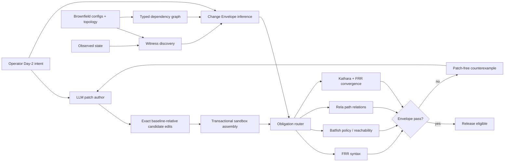

# PathDelta-Agent v8.1 architecture

## Layer 1: Intent and patch-author Agent

The model receives the natural-language intent and immutable current
configuration. It emits exact search-and-replace transactions and owns every
implementation decision. The system does not provide an expected object name,
patch template, or edit-strategy label.

## Layer 2: Coverage-directed witness discovery

Passive telemetry is insufficient: a target-exclusive policy can affect FECs
that have not recently appeared. The current development adapter extracts exact
prefix-list networks and `ge`/`le` boundary representatives, crosses known FECs
with known subjects, and evaluates the resulting pre-state behavior. The formal
version should use Batfish symbolic route-policy equivalence classes. Coverage
and uncovered reasons are serialized into the envelope.

## Layer 3: Change Envelope inference

The envelope contains four hard components and one soft component:

- relational target delta;
- semantic complement frame;
- protected external/shared dependency closure;
- hard device/object/binding/line footprint; and
- soft naming, sequence, parameter-grid, and reuse preferences.

The dependency graph models neighbor bindings, route-maps, prefix-lists,
community-lists, and route-map calls. Object definitions carry normalized
SHA-256 fingerprints so value-only edits cannot evade graph differencing.

## Layer 4: Candidate transaction and evidence routing

Every candidate is applied to the immutable baseline. Backend selection follows
the obligation type: FRR parses commands; Batfish compares route policies and
reachability; Rela checks old/new path relations; Kathara validates selected
converged control-plane cases. Backend disagreement and `N/A` remain explicit.

## Layer 5: Counterexample-guided revision

A failing candidate yields obligation IDs and observed changed atoms or
protected dependency nodes. Feedback is schema-checked to exclude expected
patches, replacement text, recommended objects, and strategy words. The LLM
then revises its own baseline-relative transaction. Release is fail-closed if
the bounded loop ends without an envelope pass.

## Trust boundary

Trusted: intent relation grounding, witness-query planner, dependency extraction,
envelope inference, transaction application, backends, and feedback sanitizer.

Untrusted: LLM reasoning, object choice, patch shape, exact commands, and all
revisions.

This boundary preserves the Agent while making safety claims about a checkable
contract rather than about the model's internal reasoning.
